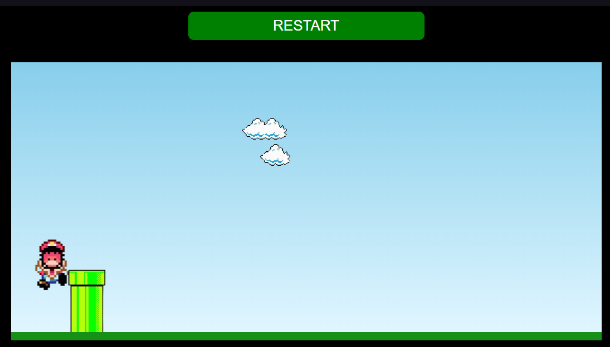

# 🎮 Project Jogo Mario

Bem-vindo ao **Project Jogo Mario**! Este projeto é uma recriação simples e divertida do clássico jogo de plataforma inspirado no Super Mario Bros. Desenvolvido no curso Full Stack do DevClub para praticar habilidades em desenvolvimento web, incluindo HTML, CSS e JavaScript.

---

## 📋 Descrição

**Project Jogo Mario** traz elementos básicos de um jogo de plataforma 2D:
- Controle do personagem principal.
- Cenários interativos.
- Obstáculos e mecânicas de movimentação.

O objetivo principal é oferecer uma introdução ao desenvolvimento de jogos no navegador, com uma abordagem criativa e prática.

---

## 🚀 Tecnologias Utilizadas

- **HTML5**: Estrutura do jogo.
- **CSS3**: Estilização do cenário e do personagem.
- **JavaScript**: Lógica e interatividade.

---

## 🎮 Funcionalidades

- Movimentação do personagem com **teclas de controle**.
- Animação fluida para personagens e objetos.
- Interatividade com obstáculos no cenário.

---

## 📦 Como Executar o Projeto

### Clonar o Repositório

git clone https://github.com/NatanMendesDF/Project-Jogo-Mario.git

Abrir o Arquivo
1. Navegue até a pasta do projeto:
cd Project-Jogo-Mario
2. Abra o arquivo index.html no navegador para iniciar o jogo.

---

## 📷 Demonstração

---

## 📌 Próximos Passos
Funcionalidades que podem ser implementadas no futuro:
-> Adicionar inimigos no cenário.
-> Criar fases diferentes com níveis de dificuldade.
-> Sistema de pontuação e coleta de itens.

---

## 🤝 Contribuição
Contribuições são bem-vindas! Para contribuir:
1. Faça um fork do repositório.
2. Crie um branch para sua feature:
git checkout -b minha-feature
3. Faça um pull request para análise.

## 📧 Contato
Se você gostou deste projeto ou tem sugestões, entre em contato:

Email: natanmendes.developer@gmail.com
LinkedIn: Nataniel Mendes
GitHub: NatanMendesDF
